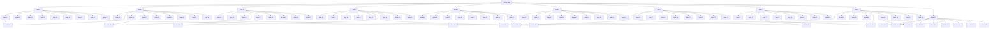

```mermaid
graph TD

%% Central hub
N0[Central Hub]

%% First ring (10 nodes)
N0 --> N1[Node 1]
N0 --> N2[Node 2]
N0 --> N3[Node 3]
N0 --> N4[Node 4]
N0 --> N5[Node 5]
N0 --> N6[Node 6]
N0 --> N7[Node 7]
N0 --> N8[Node 8]
N0 --> N9[Node 9]
N0 --> N10[Node 10]

%% Second ring (10 clusters x 9 nodes = 90 nodes)
N1 --> N11[Node 11]
N1 --> N12[Node 12]
N1 --> N13[Node 13]
N1 --> N14[Node 14]
N1 --> N15[Node 15]
N1 --> N16[Node 16]
N1 --> N17[Node 17]
N1 --> N18[Node 18]
N1 --> N19[Node 19]

N2 --> N20[Node 20]
N2 --> N21[Node 21]
N2 --> N22[Node 22]
N2 --> N23[Node 23]
N2 --> N24[Node 24]
N2 --> N25[Node 25]
N2 --> N26[Node 26]
N2 --> N27[Node 27]
N2 --> N28[Node 28]

N3 --> N29[Node 29]
N3 --> N30[Node 30]
N3 --> N31[Node 31]
N3 --> N32[Node 32]
N3 --> N33[Node 33]
N3 --> N34[Node 34]
N3 --> N35[Node 35]
N3 --> N36[Node 36]
N3 --> N37[Node 37]

N4 --> N38[Node 38]
N4 --> N39[Node 39]
N4 --> N40[Node 40]
N4 --> N41[Node 41]
N4 --> N42[Node 42]
N4 --> N43[Node 43]
N4 --> N44[Node 44]
N4 --> N45[Node 45]
N4 --> N46[Node 46]

N5 --> N47[Node 47]
N5 --> N48[Node 48]
N5 --> N49[Node 49]
N5 --> N50[Node 50]
N5 --> N51[Node 51]
N5 --> N52[Node 52]
N5 --> N53[Node 53]
N5 --> N54[Node 54]
N5 --> N55[Node 55]

N6 --> N56[Node 56]
N6 --> N57[Node 57]
N6 --> N58[Node 58]
N6 --> N59[Node 59]
N6 --> N60[Node 60]
N6 --> N61[Node 61]
N6 --> N62[Node 62]
N6 --> N63[Node 63]
N6 --> N64[Node 64]

N7 --> N65[Node 65]
N7 --> N66[Node 66]
N7 --> N67[Node 67]
N7 --> N68[Node 68]
N7 --> N69[Node 69]
N7 --> N70[Node 70]
N7 --> N71[Node 71]
N7 --> N72[Node 72]
N7 --> N73[Node 73]

N8 --> N74[Node 74]
N8 --> N75[Node 75]
N8 --> N76[Node 76]
N8 --> N77[Node 77]
N8 --> N78[Node 78]
N8 --> N79[Node 79]
N8 --> N80[Node 80]
N8 --> N81[Node 81]
N8 --> N82[Node 82]

N9 --> N83[Node 83]
N9 --> N84[Node 84]
N9 --> N85[Node 85]
N9 --> N86[Node 86]
N9 --> N87[Node 87]
N9 --> N88[Node 88]
N9 --> N89[Node 89]
N9 --> N90[Node 90]
N9 --> N91[Node 91]

N10 --> N92[Node 92]
N10 --> N93[Node 93]
N10 --> N94[Node 94]
N10 --> N95[Node 95]
N10 --> N96[Node 96]
N10 --> N97[Node 97]
N10 --> N98[Node 98]
N10 --> N99[Node 99]
N10 --> N100[Node 100]
N10 --> N101[Node 101]

%% A few cross-links for extra density
N11 --> N21
N22 --> N32
N33 --> N43
N44 --> N54
N55 --> N65
N66 --> N76
N77 --> N87
N88 --> N98
N19 --> N83
N29 --> N92
```
