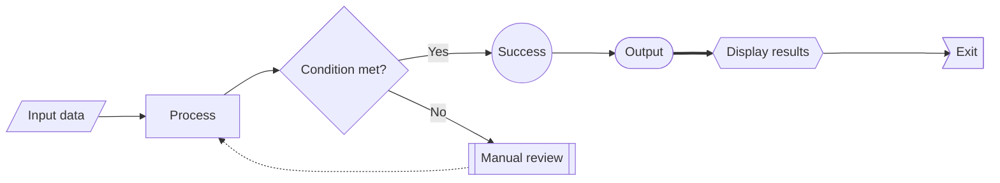

```mermaid
flowchart LR
    A[/Input data/] --> B[Process]
    B --> C{Condition met?}
    C -->|Yes| D((Success))
    C -->|No| E[[Manual review]]
    D --> F([Output])
    E -.-> B
    F ==> G{{Display results}}
    G ----> H>Exit]
```
